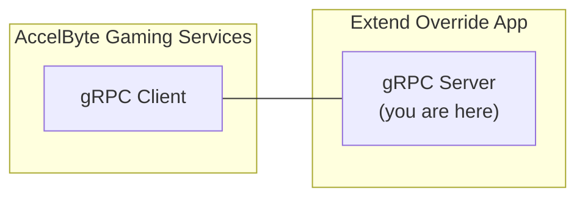

# matchmaking-function-grpc-plugin-server-csharp



`AccelByte Gaming Services`  features can be customized by using `Extend Override`
apps. An `Extend Override` app is essentially a `gRPC server` which contains one 
or more custom functions which can be called by `AccelByte Gaming Services` 
instead of the default functions. 

## Overview

This repository contains a sample `Extend Override` app for `matchmaking function`
written in `C#`. It shows how a custom matchmaking logic which matches 2
players may be implemented.

This sample app also shows the instrumentation setup necessary for observability. It
is required so that metrics, traces, and logs are able to flow properly when the 
app is deployed.

## Prerequisites

1. Windows 10 WSL2 or Linux Ubuntu 20.04 with the following tools installed.

   a. bash

   b. make

   c. [docker v23.x](https://docs.docker.com/engine/install/ubuntu/)

   d. .net 6 sdk

   e. git

   f. [postman](https://www.postman.com/)

2. Access to `AccelByte Gaming Services` environment.

   a. Base URL
   
      - For `Starter` tier e.g.  https://spaceshooter.gamingservices.accelbyte.io
      - For `Premium` tier e.g.  https://dev.accelbyte.io
      
   b. [Create a Game Namespace](https://docs.accelbyte.io/gaming-services/tutorials/how-to/create-a-game-namespace/) if you don't have one yet. Keep the `Namespace ID`.

   c. [Create an OAuth Client](https://docs.accelbyte.io/gaming-services/services/access/authorization/manage-access-control-for-applications/#create-an-iam-client) with confidential client type with the following permission. Keep the `Client ID` and `Client Secret`.

## Setup

1. Create a docker compose `.env` file by copying the content of [.env.template](.env.template) file.

   > :warning: **The host OS environment variables have higher precedence compared to `.env` file variables**: If the variables in `.env` file do not seem to take effect properly, check if there are host OS environment variables with the same name. 
   See documentation about [docker compose environment variables precedence](https://docs.docker.com/compose/environment-variables/envvars-precedence/) for more details.

2. Fill in the required environment variables in `.env` file as shown below.

   ```
   AB_BASE_URL=https://test.accelbyte.io     # Base URL of AccelByte Gaming Services environment
   AB_CLIENT_ID='xxxxxxxxxx'                 # Client ID from the Prerequisites section
   AB_CLIENT_SECRET='xxxxxxxxxx'             # Client Secret from the Prerequisites section
   AB_NAMESPACE='xxxxxxxxxx'                 # Namespace ID from the Prerequisites section
   PLUGIN_GRPC_SERVER_AUTH_ENABLED=true      # Enable or disable access token validation
   ```

   > :info: **In this sample app, PLUGIN_GRPC_SERVER_AUTH_ENABLED is `true` by default**: If it is set to `false`, the 
   `gRPC server` can be invoked without `AccelByte Gaming Services` access token. This option is provided for development 
   purpose only. It is recommended to enable `gRPC server` access token validation in production environment.

For more options, create `src/AccelByte.PluginArch.Demo.Server/appsettings.Development.json` and fill in the required configuration.

```json
{
  "DirectLogToLoki": false,
  "EnableAuthorization": true,                 // Enable or disable access token and permission check (env var: PLUGIN_GRPC_SERVER_AUTH_ENABLED)
  "RevocationListRefreshPeriod": 60,
  "AccelByte": {
    "BaseUrl": "https://test.accelbyte.io",     // Base URL (env var: AB_BASE_URL)
    "ClientId": "xxxxxxxxxx",                   // Client ID (env var: AB_CLIENT_ID)    
    "ClientSecret": "xxxxxxxxxx",               // Client Secret (env var: AB_CLIENT_SECRET)
    "AppName": "MMV2GRPCSERVICE",
    "TraceIdVersion": "1",
    "Namespace": "xxxxxxxxxx",                  // Namespace ID (env var: AB_NAMESPACE)
    "EnableTraceId": true,
    "EnableUserAgentInfo": true,
    "ResourceName": "MMV2GRPCSERVICE"
  }
}
```
> :warning: **Environment variables will override related values in this file**.

## Building

To build this sample app, use the following command.

```
make build
```

The build output will be available in `.output` directory.

## Running

To (build and) run this sample app in a container, use the following command.

```
docker compose up --build
```

## Testing

### Test in Local Development Environment

> :warning: **To perform the following, make sure PLUGIN_GRPC_SERVER_AUTH_ENABLED is set to `false`**: Otherwise,
the gRPC request will be rejected by the `gRPC server`.

The custom functions in this sample app can be tested locally using [postman](https://www.postman.com/).

1. Run this `gRPC server` sample app by using the command below.

   ```shell
   docker compose up --build
   ```

2. Open `postman`, create a new `gRPC request`, and enter `localhost:6565` as server URL (see tutorial [here](https://blog.postman.com/postman-now-supports-grpc/)). 

3. Continue by selecting `MakeMatches` grpc stream method and click `Invoke` button. This will start stream connection to the grpc server sample app.

4. Proceed by sending parameters first to specify number of players in a match by copying sample `json` below and click `Send`.

   ```json
   {
       "parameters": {
           "rules": {
               "json": "{\"shipCountMin\":2, \"shipCountMax\":2}"
           }
       }
   }
   ```

5. Now we can send match ticket to start matchmaking by copying sample `json` below and replace it into `postman` message then click `Send`.

   ```json
   {
       "ticket": {
           "players": [
               {
                   "player_id": "playerA"
               }
           ]
       }
   }
   ```

6. You can do step *5* multiple times until the number of players is met and a match can be created. In this case, it is 2 players.

7. If successful, you will receive responses (down stream) in `postman` that looks like the following.

   ```json
   {
       "match": {
           "tickets": [],
           "teams": [
               {
                   "user_ids": [
                       "playerA",
                       "playerB"
                   ]
               }
           ],
           "region_preferences": [
               "any"
           ],
           "match_attributes": null
       }
   }
   ```


### Test with AccelByte Gaming Services

For testing this sample app which is running locally with `AccelByte Gaming Services`,
the `gRPC server` needs to be exposed to the internet. To do this without requiring public IP, we can use something like [ngrok](https://ngrok.com/).

1. Run this `gRPC server` sample app by using command below.

   ```shell
   docker compose up --build
   ```

2. Sign-in/sign-up to [ngrok](https://ngrok.com/) and get your auth token in `ngrok` dashboard.

3. In this sample app root directory, run the following helper command to expose `gRPC server` port in local development environment to the internet. Take a note of the `ngrok` forwarding URL e.g. `http://0.tcp.ap.ngrok.io:xxxxx`.

   ```
   make ngrok NGROK_AUTHTOKEN=xxxxxxxxxxx
   ```

   > :warning: **If you are running [grpc-plugin-dependencies](https://github.com/AccelByte/grpc-plugin-dependencies) stack alongside this sample app as mentioned in [Test Observability](#test-observability)**: Run the above 
   command in `grpc-plugin-dependencies` directory instead of this sample app directory. 
   This way, the `gRPC server` will be called via `Envoy` service within `grpc-plugin-dependencies` stack instead of directly.

4. [Create an OAuth Client](https://docs.accelbyte.io/guides/access/iam-client.html) with `confidential` client type with the following permissions. Keep the `Client ID` and `Client Secret`.
   
   - NAMESPACE:{namespace}:MATCHMAKING:RULES [CREATE, READ, UPDATE, DELETE]
   - NAMESPACE:{namespace}:MATCHMAKING:FUNCTIONS [CREATE, READ, UPDATE, DELETE]
   - NAMESPACE:{namespace}:MATCHMAKING:POOL [CREATE, READ, UPDATE, DELETE]
   - NAMESPACE:{namespace}:MATCHMAKING:TICKET [CREATE, READ, UPDATE, DELETE]
   - ADMIN:NAMESPACE:{namespace}:INFORMATION:USER:* [CREATE, READ, UPDATE, DELETE]
   - ADMIN:NAMESPACE:{namespace}:SESSION:CONFIGURATION:* [CREATE, READ, UPDATE, DELETE]

   > :warning: **Oauth Client created in this step is different from the one from Prerequisites section:** It is required by [demo.sh](demo.sh) script in the next step to register the `gRPC Server` URL and also to create and delete test users.
   
5. Run the [demo.sh](demo.sh) script to simulate the matchmaking flow which calls this sample app `gRPC server` using the `Client ID` and `Client Secret` created in the previous step. Pay attention to sample `gRPC server` console log when matchmaking flow is running. `gRPC Server` methods should get called when creating match tickets and it should group players in twos.

   ```
   export AB_BASE_URL='https://test.accelbyte.io'
   export AB_CLIENT_ID='xxxxxxxxxx'         # Use Client ID from the previous step
   export AB_CLIENT_SECRET='xxxxxxxxxx'     # Use Client Secret from the previous step    
   export AB_NAMESPACE='accelbyte'          # Use your Namespace ID
   export GRPC_SERVER_URL='http://0.tcp.ap.ngrok.io:xxxxx'  # Use your ngrok forwarding URL
   bash demo.sh
   ```

   > :warning: **Make sure demo.sh has Unix line-endings (LF)**: If this repository was cloned in Windows for example, the `demo.sh` may have Windows line-endings (CRLF) instead. In this case, use tools like `dos2unix` to change the line-endings to Unix (LF).
   Invalid line-endings may cause errors such as `demo.sh: line 2: $'\r': command not found`.
 
> :warning: **Ngrok free plan has some limitations**: You may want to use paid plan if the traffic is high.

### Test Observability

To be able to see the how the observability works in this sample app locally, there are few things that need be setup before performing tests.

1. Uncomment loki logging driver in [docker-compose.yaml](docker-compose.yaml)

   ```
    # logging:
    #   driver: loki
    #   options:
    #     loki-url: http://host.docker.internal:3100/loki/api/v1/push
    #     mode: non-blocking
    #     max-buffer-size: 4m
    #     loki-retries: "3"
   ```

   > :warning: **Make sure to install docker loki plugin beforehand**: Otherwise,
   this sample app will not be able to run. This is required so that container logs
   can flow to the `loki` service within `grpc-plugin-dependencies` stack. 
   Use this command to install docker loki plugin: `docker plugin install grafana/loki-docker-driver:latest --alias loki --grant-all-permissions`.

2. Clone and run [grpc-plugin-dependencies](https://github.com/AccelByte/grpc-plugin-dependencies) stack alongside this sample app. After this, Grafana 
will be accessible at http://localhost:3000.

   ```
   git clone https://github.com/AccelByte/grpc-plugin-dependencies.git
   cd grpc-plugin-dependencies
   docker-compose up
   ```

   > :exclamation: More information about [grpc-plugin-dependencies](https://github.com/AccelByte/grpc-plugin-dependencies) is available [here](https://github.com/AccelByte/grpc-plugin-dependencies/blob/main/README.md).

3. Perform testing. For example, by following [Test in Local Development Environment](#test-in-local-development-environment) or [Test with AccelByte Gaming Services](#test-with-accelbyte-gaming-services).

## Deploying

After done testing, you may want to deploy this app to `AccelByte Gaming Services`.

1. [Create a new Extend Override App on Admin Portal](https://docs.accelbyte.io/gaming-services/services/extend/override-ags-feature/getting-started-with-matchmaking-customization/#create-an-extend-app). Keep the `Repository URI`.
2. Download and setup [extend-helper-cli](https://github.com/AccelByte/extend-helper-cli/) (only if it has not been done previously).
3. Perform docker login with `extend-helper-cli` using the following command.
   ```
   extend-helper-cli dockerlogin --namespace <my-game> --app <my-app> --login
   ```
   > :exclamation: For your convenience, the above `extend-helper-cli` command can also be 
   copied from `Repository Authentication Command` under the corresponding app detail page.
4. Build and push sample app docker image to AccelByte ECR using the following command.
   ```
   make imagex_push IMAGE_TAG=v0.0.1 REPO_URL=xxxxxxxxxx.dkr.ecr.us-west-2.amazonaws.com/accelbyte/justice/development/extend/xxxxxxxxxx/xxxxxxxxxx
   ```
   > :exclamation: **The REPO_URL is obtained from step 1**: It can be found under 'Repository URI' in the app detail.

## Advanced

### About appsettings.*.json

|Key|Description|Default|
|-|-|-|
|Kestrel.Endpoints.Http.Url|Prometheus scrapper endpoint|http://0.0.0.0:8080|
|Kestrel.Endpoints.Grpc.Url|Grpc service endpoint|http://0.0.0.0:6565|
|DirectLogToLoki|Enable sending log directly to Loki|false|
|LokiUrl|Loki URL for sending log (can be overridden by env var)|http://localhost:3100|
|EnableAuthorization|Enable access token validation|true|
|RevocationListRefreshPeriod|Interval value to refresh token revocation list cache (in seconds)|600|
|AccelByte.BaseUrl|AccelByte Cloud url. [Here](https://github.com/AccelByte/accelbyte-csharp-sdk/blob/main/README.md#usage) for more information||
|AccelByte.ClientId|OAuth client id. [Here](https://github.com/AccelByte/accelbyte-csharp-sdk/blob/main/README.md#usage) for more information||
|AccelByte.ClientSecret|OAuth client secret. [Here](https://github.com/AccelByte/accelbyte-csharp-sdk/blob/main/README.md#usage) for more information||
|AccelByte.Namespace|AccelByte Cloud namespace. [Here](https://github.com/AccelByte/accelbyte-csharp-sdk/blob/main/README.md#usage) for more information||
|AccelByte.AppName|Grpc service application name|MMV2GRPCSERVICE|
|AccelByte.ResourceName|Grpc service resource or instance name|MMV2GRPCSERVICE|

### Environment variables in docker-compose.yml

|Key|Description|
|-|-|
|ASPNETCORE_ENVIRONMENT|ASP.NET Core runtime environment. Read more about it [here](https://learn.microsoft.com/en-us/aspnet/core/fundamentals/environments?view=aspnetcore-6.0). Default is `Development`. Make sure that this value match the name for appsettings json file. E.g. `Development` will read configuration value from `appsettings.Development.json` and `Production` will read configuration value from `appsettings.Production.json`.|
|OTEL_EXPORTER_ZIPKIN_ENDPOINT|[OpenTelemetry zipkin endpoint](https://github.com/open-telemetry/opentelemetry-dotnet/blob/main/src/OpenTelemetry.Exporter.Zipkin/README.md).|
|ASPNETCORE_SERILOG_LOKI|Set Loki instance url to send log directly to Loki. If this var is specified, it will override `LokiUrl` in `appsettings`|
